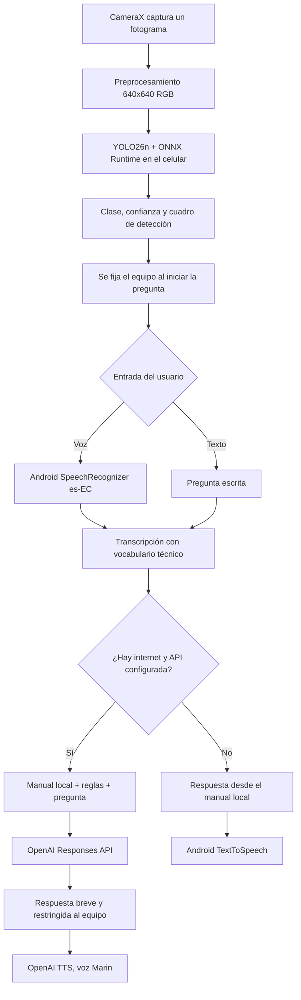

<h1 align="center">
  
  LabDetect
</h1>

<p align="center">
  Asistente móvil inteligente para detectar equipos del Laboratorio de Bromatología de la UTEQ y consultar su información técnica mediante voz o texto.
</p>

<p align="center">
  
  
  
  
  
  
  
  
  
  
  
  
  
</p>

---

##  Descripción

**LabDetect** es una aplicación Android que detecta, localiza e identifica en tiempo real **25 clases de equipos** del Laboratorio de Bromatología de la UTEQ. La cámara se procesa con **CameraX** y el modelo **Ultralytics YOLO26n**, exportado a **ONNX**, se ejecuta completamente dentro del teléfono mediante **ONNX Runtime Mobile**.

Después de detectar un equipo, el usuario puede tocar el micrófono para comenzar, hablar con normalidad y tocarlo nuevamente para enviar, o escribir una pregunta. La aplicación fija el último equipo detectado como contexto, recupera su manual local y construye un prompt restringido para la **OpenAI Responses API**. La respuesta es breve, técnica y conversacional; se reproduce con la voz **Marin** de OpenAI y utiliza **Android TextToSpeech** cuando no hay conexión.

La aplicación también conserva fichas técnicas, manuales, consultas básicas y favoritos de forma local para seguir siendo útil sin internet.

##  Datos académicos

-  **Universidad:** Universidad Técnica Estatal de Quevedo
-  **Facultad:** Ciencias de la Computación
-  **Carrera:** Software
-  **Materia:** Aplicaciones Móviles — Examen Final, Tema 2: Laboratorio de Bromatología

##  Integrantes — Grupo 2 (CHRS)

- Joseph Calderón Saltos
- Humberto Herrera Barco
- Eduardo Reinoso Vélez
- John Silva Triviño

##  Tecnologías

| Tecnología | Uso dentro de LabDetect |
|---|---|
| **Kotlin** | Lenguaje principal de la aplicación. |
| **Android SDK 34** | Plataforma móvil; compatibilidad desde Android 8.0, API 26. |
| **Gradle Kotlin DSL + JDK 17** | Compilación, configuración y dependencias. |
| **CameraX** | Vista previa, ciclo de vida de la cámara y captura periódica de fotogramas. |
| **Ultralytics YOLO26n** | Modelo entrenado para reconocer los 25 equipos. |
| **Python + PyTorch + CUDA** | Entrenamiento y evaluación acelerados localmente con la GPU NVIDIA. |
| **Roboflow / formato YOLO** | Organización, revisión y exportación inicial del dataset etiquetado. |
| **ONNX Runtime Android** | Inferencia del modelo dentro del celular, sin enviar imágenes a servidores. |
| **Material Design 3** | Interfaz moderna, accesible y con tema oscuro verde institucional. |
| **Navigation Component** | Navegación entre cámara y ficha del equipo. |
| **MVVM + LiveData + Coroutines** | Separación de interfaz, estado, detección y consultas asíncronas. |
| **OpenAI Responses API** | Generación de respuestas técnicas con el manual del equipo como contexto. |
| **OpenAI Web Search** | Complemento técnico opcional cuando el manual no cubre una información general. |
| **OpenAI Audio Speech** | Voz neuronal **Marin** para leer las respuestas naturalmente. |
| **Android SpeechRecognizer** | Conversión de la pregunta hablada a texto en español de Ecuador, con vocabulario de laboratorio. |
| **Android TextToSpeech** | Voz de respaldo cuando OpenAI o internet no están disponibles. |
| **JSON local + SharedPreferences** | Catálogo, manuales, características y favoritos offline. |

##  Funcionalidades

-  Detección de equipos en tiempo real con cuadros delimitadores.
-  Inferencia YOLO completamente local mediante ONNX Runtime.
-  Segunda pasada automática sobre el centro de la imagen para mejorar detecciones lejanas.
-  Porcentaje de confianza y detección simultánea de varios equipos.
-  Un toque para comenzar a escuchar y otro para enviar la pregunta.
-  Preguntas por voz o texto con contexto documental del equipo detectado.
-  Lectura natural con OpenAI Marin y respaldo con Android TTS.
-  Fichas, características y manuales disponibles offline.
-  Equipos favoritos guardados localmente.
-  El asistente rechaza preguntas ajenas al equipo enfocado y evita inventar procedimientos peligrosos.

##  Flujo de funcionamiento



### ¿Cómo se conecta la IA?

1. **CameraX** entrega una imagen de la cámara a la aplicación.
2. **YOLO26n** identifica el equipo en el propio celular; la fotografía no se envía a OpenAI.
3. Con el primer toque al micrófono, la app congela lógicamente el último equipo detectado y pausa el análisis YOLO; con el segundo toque termina el dictado y procesa la pregunta.
4. **Android SpeechRecognizer** convierte la voz a texto, prioriza español de Ecuador, nombres de equipos y términos del laboratorio.
5. La aplicación recupera de `manual_text.json` el contenido correspondiente al equipo.
6. Se construye un prompt con tres partes: reglas del asistente, pregunta transcrita y contenido del manual.
7. La **Responses API** recibe ese contexto. Debe responder únicamente sobre el equipo, en lenguaje natural, entre dos y cuatro oraciones; si la pregunta no corresponde, la rechaza.
8. El texto se envía a **OpenAI Audio Speech** y se reproduce con la voz **Marin**. Si falla la conexión, se utiliza el contenido y la voz offline de Android.

> Este enfoque es un **RAG documental ligero**: la recuperación del documento ocurre localmente y el fragmento completo del manual correspondiente se inserta como contexto. No depende de un vector store ni de File Search.

##  Modelo de detección

| Propiedad | Valor |
|---|---:|
| Modelo | Ultralytics YOLO26n |
| Formato móvil | ONNX |
| Entrada | `1 × 3 × 640 × 640`, RGB normalizado entre 0 y 1 |
| Clases | 25 |
| Imágenes de prueba independientes | 278 |
| Instancias de prueba | 287 |
| Precisión | 92.22 % |
| Recall | 90.68 % |
| mAP50 | 93.46 % |
| mAP50–95 | 89.41 % |
| Mejor época | 35 |
| Ultralytics | 8.4.138 |

El detector aplica *letterbox*, normalización NCHW, umbral de confianza del 25 %, NMS embebido y una segunda inferencia sobre un recorte central cuando la primera detección no supera el 60 %.

##  Funcionamiento offline y online

| Función | Sin internet | Con internet |
|---|:---:|:---:|
| Cámara y detección YOLO | ✅ | ✅ |
| Cuadros y porcentaje de confianza | ✅ | ✅ |
| Ficha y características | ✅ | ✅ |
| Manual local | ✅ | ✅ |
| Favoritos | ✅ | ✅ |
| Preguntas básicas sobre el manual | ✅ | ✅ |
| Respuesta generativa con OpenAI | — | ✅ |
| Búsqueda web técnica controlada | — | ✅ |
| Voz Android TTS | ✅ | ✅ respaldo |
| Voz neuronal Marin | — | ✅ |

##  Estructura del proyecto

```text
LabDetect/
├── app/
│   └── src/main/
│       ├── assets/
│       │   ├── equipment_catalog.json          Catálogo y variantes
│       │   ├── manual_text.json                Contenido documental offline
│       │   ├── labdetect_yolo26n.onnx          Modelo de detección
│       │   └── labdetect_yolo26n.metadata.json Clases, entrada y métricas
│       ├── java/com/example/labdetect/
│       │   ├── data/                            ONNX, catálogo, manuales y OpenAI
│       │   ├── domain/                          Entidades y contratos
│       │   ├── speech/                          OpenAI TTS y Android TTS
│       │   ├── viewmodel/                       Estado y lógica MVVM
│       │   ├── CameraFragment.kt                Cámara, voz e interacción
│       │   └── DetailFragment.kt                Ficha, manual y preguntas
│       └── res/                                 Interfaz Material 3 y navegación
├── gradle/libs.versions.toml                    Versiones de dependencias
├── app/build.gradle.kts                         Configuración Android y API
├── settings.gradle.kts
└── README.md
```

##  Requisitos

- Android Studio compatible con AGP 9.2.1.
- JDK 17.
- Android SDK 34.
- Dispositivo físico Android 8.0 o superior con cámara y micrófono.
- Internet para respuestas y voz de OpenAI.
- Crédito y una clave válida de OpenAI API para el modo online.

##  Instalación

**1. Clonar el repositorio**

```bash
git clone https://github.com/aldairHub/LabDetect.git
cd LabDetect
```

**2. Abrir el proyecto en Android Studio**

Abre la carpeta raíz `LabDetect` y espera la sincronización de Gradle.

**3. Configurar OpenAI localmente**

Agrega estas propiedades a `local.properties` sin subir ese archivo a Git:

```properties
OPENAI_API_KEY=tu_clave_api
OPENAI_MODEL=gpt-5.4-mini
OPENAI_TTS_MODEL=gpt-4o-mini-tts
```

**4. Ejecutar**

Conecta un teléfono, concede permisos de cámara y micrófono y ejecuta el módulo `app` desde Android Studio.

> **Seguridad:** en el prototipo académico la clave se incorpora a `BuildConfig` y la APK llama directamente a OpenAI. Esto permite distribuir una demostración, pero una clave dentro de una APK puede extraerse. Para producción pública se debe mover la llamada a un backend propio con autenticación, límites de consumo y rotación de claves.

##  Privacidad y alcance

- Las imágenes de la cámara se procesan localmente y no se envían a OpenAI.
- En el modo online se envían la pregunta, el nombre del equipo y el texto de su manual para generar la respuesta.
- El reconocimiento de voz depende del proveedor de reconocimiento configurado en Android y puede usar internet.
- La búsqueda web está disponible únicamente como apoyo técnico; el manual local sigue siendo la fuente principal.
- El asistente está restringido al equipo enfocado y no debe responder temas ajenos.

##  Licencia

Proyecto académico desarrollado para la asignatura de Aplicaciones Móviles de la Universidad Técnica Estatal de Quevedo.
