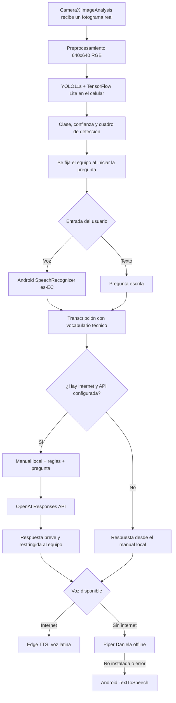

<h1 align="center">
  
  LabDetect
</h1>

<p align="center">
  Asistente móvil inteligente para detectar equipos del Laboratorio de Bromatología de la UTEQ y consultar su información técnica mediante voz o texto.
</p>

<p align="center">
  
  
  
  
  
  
  
  
  
  
  
  
  
</p>

---

##  Descripción

**LabDetect** es una aplicación Android que detecta, localiza e identifica en tiempo real **25 clases de equipos** del Laboratorio de Bromatología de la UTEQ. La cámara se procesa con **CameraX** y el modelo **Ultralytics YOLO11s**, exportado a **TensorFlow Lite**, se ejecuta completamente dentro del teléfono.

Después de detectar un equipo, el usuario puede tocar el micrófono para comenzar, hablar con normalidad y tocarlo nuevamente para enviar, o escribir una pregunta. La aplicación fija el último equipo detectado como contexto, mantiene la vista previa de la cámara activa y pausa únicamente el análisis mientras responde. Recupera su manual local y construye un prompt restringido para la **OpenAI Responses API**. La respuesta es breve, técnica y conversacional; se reproduce con una voz neuronal latina de **Microsoft Edge Read Aloud**. Si no hay conexión, utiliza la voz neural local **Piper Daniela**; Android TextToSpeech queda como último respaldo.

La interfaz utiliza modo oscuro fijo y verde institucional UTEQ, con controles compactos para no ocultar la cámara. La aplicación conserva fichas técnicas, manuales, consultas, recientes, favoritos y correcciones voluntarias de detección de forma local para seguir siendo útil sin internet.

##  Datos académicos

-  **Universidad:** Universidad Técnica Estatal de Quevedo
-  **Facultad:** Ciencias de la Computación
-  **Carrera:** Software
-  **Materia:** Aplicaciones Móviles — Examen Final, Tema 2: Laboratorio de Bromatología

##  Integrantes — Grupo 2 (CHRS)

- Joseph Calderón Saltos
- Humberto Herrera Barco
- Eduardo Reinoso Vélez
- John Silva Triviño

##  Tecnologías

| Tecnología | Uso dentro de LabDetect |
|---|---|
| **Kotlin** | Lenguaje principal de la aplicación. |
| **Android SDK 34** | Plataforma móvil; compatibilidad desde Android 8.0, API 26. |
| **Gradle Kotlin DSL + JDK 17** | Compilación, configuración y dependencias. |
| **CameraX** | Vista previa, ciclo de vida de la cámara y análisis directo de fotogramas reales. |
| **Ultralytics YOLO11s** | Modelo entrenado para reconocer los 25 equipos. |
| **Python + PyTorch + CUDA** | Entrenamiento y evaluación acelerados localmente con la GPU NVIDIA. |
| **Roboflow / formato YOLO** | Organización, revisión y exportación inicial del dataset etiquetado. |
| **TensorFlow Lite + XNNPACK** | Inferencia acelerada del modelo dentro del celular, sin enviar imágenes a servidores. |
| **Material Design 3** | Interfaz moderna, compacta y accesible, con modo oscuro fijo y verde institucional UTEQ. |
| **Navigation Component** | Navegación entre cámara y ficha del equipo. |
| **MVVM + LiveData + Coroutines** | Separación de interfaz, estado, detección y consultas asíncronas. |
| **OpenAI Responses API + File Search** | Recupera primero la sección de características, operación, seguridad o mantenimiento asociada únicamente al equipo detectado. |
| **OpenAI Web Search** | Se activa solo si el manual no contiene la respuesta; la app lo comunica naturalmente antes de complementar la información. |
| **Microsoft Edge Read Aloud** | Voz neuronal online en español latino para leer las respuestas sin consumir crédito de OpenAI. |
| **Piper Daniela High int8 + Sherpa-ONNX** | Voz neural offline en español latino. Su paquete se instala una sola vez por Wi-Fi en el almacenamiento privado de la app, para no cargarlo en el APK inicial. |
| **Android SpeechRecognizer** | Conversión de la pregunta hablada a texto en español de Ecuador, con vocabulario de laboratorio. |
| **Android TextToSpeech** | Último respaldo si Edge no está disponible y Piper aún no se ha instalado o falla. |
| **JSON local + SharedPreferences** | Catálogo, manuales, características, favoritos, recientes, historial y retroalimentación local. |

##  Funcionalidades

-  Detección de equipos en tiempo real con cuadros delimitadores.
-  Inferencia YOLO completamente local mediante TensorFlow Lite.
-  Segunda pasada automática sobre el centro de la imagen para mejorar detecciones lejanas.
-  Porcentaje de confianza y detección simultánea de varios equipos.
-  Cámara protagonista, tarjeta compacta de detección y controles flotantes que no cubren la vista.
-  Un toque para comenzar a escuchar y otro para enviar la pregunta.
-  Estados visuales y animaciones ligeras al escuchar, procesar y responder.
-  Preguntas por voz o texto con contexto documental del equipo detectado.
-  Índices File Search aislados por equipo; cada manual se consulta por bloques de características, operación, seguridad o mantenimiento/problemas, mientras el PDF completo queda en Storage.
-  Contexto breve de conversación por equipo para responder de forma natural sin guardar diálogos en el teléfono.
-  Lectura natural con Edge en español latino, Piper neural offline y Android TTS como último respaldo.
-  Fichas, características y manuales disponibles offline.
-  Acciones rápidas offline para consultar función, preparación, seguridad y cierre sin leer un bloque largo.
-  Equipos favoritos guardados localmente.
-  Historial reciente por equipo y consultas guardadas en el dispositivo.
-  Confirmación o corrección voluntaria de detecciones; la evidencia queda local y nunca se envía automáticamente.
-  El asistente rechaza preguntas ajenas al equipo enfocado y evita inventar procedimientos peligrosos.

##  Flujo de funcionamiento



### ¿Cómo se conecta la IA?

1. **CameraX** entrega una imagen de la cámara a la aplicación.
2. **YOLO11s** identifica el equipo en el propio celular; la fotografía no se envía a OpenAI.
3. Con el primer toque al micrófono, la app fija el último equipo detectado y pausa únicamente el análisis YOLO; la cámara continúa mostrando su vista previa. Con el segundo toque termina el dictado y procesa la pregunta.
4. **Android SpeechRecognizer** convierte la voz a texto, prioriza español de Ecuador, nombres de equipos y términos del laboratorio.
5. La aplicación obtiene de `document_index.json` el ID del vector store asignado al equipo, sin usar una base de datos externa.
6. **File Search** busca en cuatro secciones breves de ese único equipo —características, operación, seguridad y mantenimiento/problemas— y recupera solo las relevantes; los PDFs completos permanecen como respaldo en Storage.
7. Se construye un prompt con reglas del asistente, pregunta transcrita, resumen local y las secciones recuperadas. La **Responses API** responde únicamente sobre el equipo, en lenguaje natural; si la pregunta no corresponde, la rechaza. Si el manual no cubre la consulta, recién entonces realiza una búsqueda web técnica y avisa que complementa la respuesta con internet.
8. El texto se envía a **Microsoft Edge Read Aloud** y se reproduce con una voz neuronal latina. Si Edge o la conexión fallan, se usa **Piper Daniela**, una voz neural instalada localmente. Si Piper aún no se instaló o no puede iniciarse, Android ofrece el último respaldo de voz.

> Este enfoque es un **RAG documental híbrido**: el catálogo de IDs se incluye en la APK, pero File Search recupera solo las secciones necesarias desde el vector store del equipo. No se expone ni se consulta documentación de otros equipos.

##  Modelo de detección

| Propiedad | Valor |
|---|---:|
| Modelo | Ultralytics YOLO11s |
| Formato móvil | TensorFlow Lite (`.tflite`) |
| Entrada | `1 × 3 × 640 × 640`, RGB normalizado entre 0 y 1 |
| Clases | 25 |
| Ultralytics | 8.4.138 |

El detector aplica *letterbox*, normalización NCHW y NMS local. Conserva candidatos desde 25 % para poder ampliar el centro cada tres análisis cuando el equipo está lejos; muestra al instante una señal desde 85 % y confirma en dos capturas consecutivas las señales entre 65 % y 84 %. Dos ausencias seguidas limpian la detección. Así mejora la respuesta sin aceptar falsos positivos débiles. Las métricas comparables del nuevo entrenamiento deben incorporarse cuando se disponga de su evaluación de validación o prueba.

> **Cobertura real del archivo actual:** el entrenamiento incluye la clase **Calentador** y no incluye **Extractor de grasa**. LabDetect no remapea una clase por otra; el calentador se muestra con su etiqueta real y permanece con documentación pendiente hasta recibir su manual.

##  Funcionamiento offline y online

| Función | Sin internet | Con internet |
|---|:---:|:---:|
| Cámara y detección YOLO | ✅ | ✅ |
| Cuadros y porcentaje de confianza | ✅ | ✅ |
| Ficha y características | ✅ | ✅ |
| Manual local | ✅ | ✅ |
| Favoritos | ✅ | ✅ |
| Acciones rápidas, guía e historial local | ✅ | ✅ |
| Recientes y correcciones voluntarias | ✅ | ✅ |
| Preguntas básicas sobre el manual | ✅ | ✅ |
| Respuesta generativa con OpenAI | — | ✅ |
| Búsqueda web técnica controlada | — | ✅ |
| Voz Android TTS | ✅ | ✅ respaldo |
| Voz neuronal Edge | — | ✅ |
| Voz neural Piper Daniela | ✅ después de la instalación inicial | ✅ respaldo |

> La voz Piper se descarga silenciosamente una vez, solamente por Wi-Fi/no medido y sin retrasar una respuesta. Una vez instalada, funciona sin conexión y no consume crédito de OpenAI.

##  Estructura del proyecto

```text
LabDetect/
├── app/
│   ├── libs/sherpa-onnx-1.13.7.aar             Motor local de Piper
│   └── src/main/
│       ├── assets/
│       │   ├── equipment_catalog.json          Catálogo y variantes
│       │   ├── document_index.json              IDs de File Search por equipo
│       │   ├── manual_text.json                Contenido documental offline
│       │   ├── labdetect_yolo11s.tflite         Modelo de detección
│       │   └── labdetect_yolo11s.metadata.json  Clases, entrada y auditoría
│       ├── java/com/example/labdetect/
│       │   ├── data/                            TensorFlow Lite, catálogo, manuales y OpenAI
│       │   ├── domain/                          Entidades y contratos
│       │   ├── speech/                          Edge TTS, Piper offline y Android TTS
│       │   ├── viewmodel/                       Estado y lógica MVVM
│       │   ├── CameraFragment.kt                Cámara, voz e interacción
│       │   └── DetailFragment.kt                Ficha, manual y preguntas
│       └── res/                                 Interfaz Material 3 y navegación
├── gradle/libs.versions.toml                    Versiones de dependencias
├── app/build.gradle.kts                         Configuración Android y API
├── settings.gradle.kts
└── README.md
```

##  Requisitos

- Android Studio compatible con AGP 9.2.1.
- JDK 17.
- Android SDK 34.
- Dispositivo físico Android 8.0 o superior con cámara y micrófono.
- Internet para respuestas de OpenAI y para la voz online de Edge.
- Wi-Fi/no medido una vez, opcional pero recomendado, para instalar la voz neural offline Piper.
- Crédito y una clave válida de OpenAI API para el modo online.

##  Instalación

**1. Clonar el repositorio**

```bash
git clone https://github.com/aldairHub/LabDetect.git
cd LabDetect
```

**2. Abrir el proyecto en Android Studio**

Abre la carpeta raíz `LabDetect` y espera la sincronización de Gradle.

**3. Configurar OpenAI localmente**

Agrega estas propiedades a `local.properties` sin subir ese archivo a Git:

```properties
OPENAI_API_KEY=tu_clave_api
OPENAI_MODEL=gpt-5.4-mini
```

**4. Ejecutar**

Conecta un teléfono, concede permisos de cámara y micrófono y ejecuta el módulo `app` desde Android Studio.

> **Seguridad:** en el prototipo académico la clave se incorpora a `BuildConfig` y la APK llama directamente a OpenAI. Esto permite distribuir una demostración, pero una clave dentro de una APK puede extraerse. Para producción pública se debe mover la llamada a un backend propio con autenticación, límites de consumo y rotación de claves.

##  Privacidad y alcance

- Las imágenes de la cámara se procesan localmente y no se envían a OpenAI.
- En el modo online se envían la pregunta, el nombre del equipo y un resumen local corto; File Search recupera de forma remota únicamente los fragmentos pertinentes del manual asignado.
- El reconocimiento de voz depende del proveedor de reconocimiento configurado en Android y puede usar internet.
- La voz Piper, cuando se instala, se guarda únicamente en el almacenamiento privado de la aplicación y se ejecuta localmente.
- La búsqueda web está disponible únicamente como apoyo técnico; el manual local sigue siendo la fuente principal.
- El asistente está restringido al equipo enfocado y no debe responder temas ajenos.

##  Licencia

Proyecto académico desarrollado para la asignatura de Aplicaciones Móviles de la Universidad Técnica Estatal de Quevedo.
